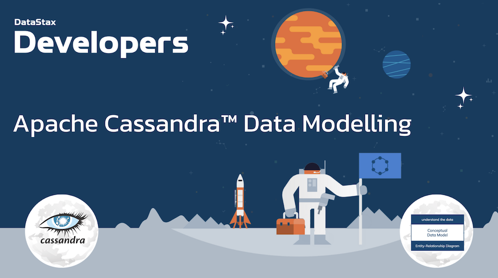

# 🎓🎓 Apache Cassandra™ Data Modelling

Welcome to the **Apache Cassandra™ Data Modelling** workshop! In this two-hour workshop, we show the methodoloy to build an effective data model with distributed `NoSQL database Apache Cassandra™`.

Using **Astra DB**, the cloud based _Cassandra-as-a-Service_ platform delivered by DataStax, we will cover the process for every developer who wants to build an applications: list the use case and build an effective data model.



It doesn't matter if you join our workshop live or you prefer to do at your own pace, we have you covered. In this repository, you'll find everything you need for this workshop:

> [🔖 Accessing HANDS-ON](#-start-hands-on)

## 📋 Table of content


1. [Objectives](#1-objectives)
2. [Frequently asked questions](#2-frequently-asked-questions)
3. [Materials for the Session](#3-materials-for-the-session)
4. [Create your Database](#4-create-your-astra-db-instance)
5. [Working with Data Types](#5-working-with-data-types)
6. [Sensor Data Scenario](#6-create-sensor-tables)
7. [Homework](#7-homework)
8. [What's NEXT ](#8-whats-next-)
<p><br/>

## 1. Objectives

1️⃣ **Give you an understanding and how and where to position Apache Cassandra™**

2️⃣ **Give an overview of the NoSQL ecosystem and its rationale**

3️⃣ **Provide an overview of Cassandra Architecture**

4️⃣ **Make you create your first tables and run your first statements**

🚀 **Have fun with an interactive session**

## 2. Frequently asked questions

<p/>
<details>
<summary><b> 1️⃣ Can I run this workshop on my computer?</b></summary>
<hr>
<p>There is nothing preventing you from running the workshop on your own machine. If you do so, you will need the following:
<ol>
<li><b>git</b> installed on your local system
</ol>
</p>
In this readme, we try to provide instructions for local development as well - but keep in mind that the main focus is development on Gitpod, hence <strong>we can't guarantee live support</strong> about local development in order to keep on track with the schedule. However, we will do our best to give you the info you need to succeed.
</details>
<p/>
<details>
<summary><b> 2️⃣ What other prerequisites are required?</b></summary>
<hr>
<ul>
<li>You will need enough *real estate* on screen, we will ask you to open a few windows and it would not fit on mobiles (tablets should be OK)
<li>You will need an Astra account: don't worry, we'll work through that in the following
<li>As "Intermediate level" we expect you to know what java and Spring are. 
</ul>
</p>
</details>
<p/>
<details>
<summary><b> 3️⃣ Do I need to pay for anything for this workshop?</b></summary>
<hr>
<b>No.</b> All tools and services we provide here are FREE. FREE not only during the session but also after.
</details>
<p/>
<details>
<summary><b> 4️⃣ Will I get a certificate if I attend this workshop?</b></summary>
<hr>
Attending the session is not enough. You need to complete the homework detailed below and you will get a nice badge that you can share on linkedin or anywhere else *(open badge specification)*
</details>
<p/>

## 3. Materials for the Session

It doesn't matter if you join our workshop live or you prefer to work at your own pace,
we have you covered. In this repository, you'll find everything you need for this workshop:

- [Slide deck](/slides/slides.pdf)
- [Discord chat](https://dtsx.io/discord)
- [Questions and Answers](https://community.datastax.com/)

----

# 🏁 Start Hands-on

## 4. Create your Astra DB instance

_**`ASTRA DB`** is the simplest way to run Cassandra with zero operations at all - just push the button and get your cluster. No credit card required, 40M read/write operations and about 80GB storage monthly for free - sufficient to run small production workloads. If you end your credits the databases will pause, no charge_

Leveraging [Database creation guide](https://awesome-astra.github.io/docs/pages/astra/create-instance/#c-procedure) create a database. *Right-Click the button* with *Open in a new TAB.*

<a href="https://astra.dev/2-16"></a>

|Field|Value|
|---|---|
|**Database Name**| `workshops`|
|**Keyspace Name**| `sensor_data`|
|**Regions**| Select `GOOGLE CLOUD`, then an Area close to you, then a region with no LOCKER 🔒 icons, those are the region you can use for free.   |

> **ℹ️ Note:** If you already have a database `workshops`, simply add a keyspace `sensor_data` using the `Add Keyspace` button on the bottom right hand corner of db dashboard page.

While the database is being created, you will also get a **Security token**:
save it somewhere safe, as it will be needed to later in others workshop (In particular the string starting with `AstraCS:...`.)

The status will change from `Pending` to `Active` when the database is ready, this will only take 2-3 minutes. You will also receive an email when it is ready.

[🏠 Back to Table of Contents](#-table-of-content)

## 5. Working with Data types

### ✅ Step 5a. `List` Collections

📘 **Command to execute**

```sql
// Definition
CREATE TABLE IF NOT EXISTS table_with_list (
  uid      uuid,
  items    list<text>,
  PRIMARY KEY (uid)
);

// Insert
INSERT INTO table_with_list(uid,items) 
VALUES (c7133017-6409-4d7a-9479-07a5c1e79306, ['a', 'b', 'c']);

// Replace
UPDATE table_with_list SET items = ['d', 'e'] 
WHERE uid = c7133017-6409-4d7a-9479-07a5c1e79306;

// Show result
SELECT * FROM table_with_list ;

// Append to list
UPDATE table_with_list SET items = items + ['f']
WHERE uid = c7133017-6409-4d7a-9479-07a5c1e79306;

// Replace an element (not available in Astra because read before write)
UPDATE table_with_list SET items[0] = ['g']
WHERE uid = c7133017-6409-4d7a-9479-07a5c1e79306;
```

### ✅ Step 5b. `Set` Collections

📘 **Command to execute**

```sql
// Definition
CREATE TABLE IF NOT EXISTS table_with_set (
  uid      uuid,
  animals  set<text>,
  PRIMARY KEY (uid)
);

// Insert
INSERT INTO table_with_set(uid,animals) 
VALUES (87fad746-4adf-4107-9858-df8643564186, {'spider', 'cat', 'dog'});

// Replace
UPDATE table_with_set SET animals = {'pangolin', 'bat'}
WHERE uid = 87fad746-4adf-4107-9858-df8643564186;

// Show result
SELECT * FROM table_with_set;

// Append to Set
UPDATE table_with_set SET animals = animals + {'sheep'}
WHERE uid = 87fad746-4adf-4107-9858-df8643564186;
```

### ✅ Step 5c. `Map` Collections

📘 **Command to execute**


```sql
// Definition
CREATE TABLE IF NOT EXISTS table_with_map (
  uid         text,
  dictionary  map<text, text>,
  PRIMARY KEY (uid)
);

// Insert
INSERT INTO table_with_map(uid, dictionary) 
VALUES ('fr_en', {'fromage':'cheese', 'vin':'wine', 'pain':'bread'});

// Replace
UPDATE table_with_map SET dictionary = {'saucisse': 'sausage'}
WHERE uid = 'fr_en';

// Show result
SELECT * FROM table_with_map;

// Append to Map
UPDATE table_with_map SET dictionary = dictionary + {'frites':'fries'}
WHERE uid = 'fr_en';
```

### ✅ Step 5d. User Defined types

📘 **Command to execute**

```sql
// Definition
CREATE TYPE IF NOT EXISTS udt_address (
  street text,
  city text,
  state text,
);

// Use the UDT in a table
CREATE TABLE IF NOT EXISTS table_with_udt (
  uid      text,
  adress   udt_address,
  PRIMARY KEY (uid)
);

// INSERT (not quote on field names like street)
INSERT INTO table_with_udt(uid, adress) 
VALUES ('superman', {street:'daily planet',city:'metropolis',state:'CA'});

// Replace
UPDATE table_with_udt 
SET adress = {street:'pingouin alley',city:'antarctica',state:'melting'}
WHERE uid = 'superman';

// Replace 1 fields
UPDATE table_with_udt 
SET adress.state = 'melt'
WHERE uid = 'superman';
```

### ✅ Step 5e. Counters

📘 **Command to execute**

```sql
// Definition
CREATE TABLE IF NOT EXISTS table_with_counters (
  handle        text,
  following     counter,
  followers     counter,
  notifications counter,
  PRIMARY KEY (handle)
);

// You have a new follower
UPDATE table_with_counters SET followers = followers + 1
WHERE  handle = 'clunven';

// Some counters are… null
SELECT * from table_with_counters;

// Set to 0…but set is not valid
UPDATE table_with_counters 
SET following = following + 0, notifications = notifications + 0
WHERE handle = 'clunven';

// Following someone
UPDATE table_with_counters SET following = following + 1
WHERE handle = 'clunven';

// You have a new message
UPDATE table_with_counters SET notifications = notifications + 1
WHERE handle = 'clunven';

```

## 6. Create Sensor Tables

📘 **Command to execute**

```sql
CREATE TABLE IF NOT EXISTS networks (
  name        TEXT,
  description TEXT,
  region      TEXT,
  PRIMARY KEY ((name))
);

CREATE TABLE IF NOT EXISTS sensors_by_network (
  network         TEXT,
  sensor          TEXT,
  latitude        DECIMAL,
  longitude       DECIMAL,
  characteristics MAP<TEXT,TEXT>,
  PRIMARY KEY ((network),sensor)
);

CREATE TABLE temperatures_by_sensor (
  sensor TEXT,
  date DATE,
  timestamp TIMESTAMP,
  value FLOAT,
  PRIMARY KEY ((sensor, date),timestamp)
) WITH CLUSTERING ORDER BY (timestamp DESC);

CREATE TABLE temperatures_by_network (
  network TEXT,
  week DATE,
  date_hour TIMESTAMP,
  sensor TEXT,
  avg_temperature FLOAT,
  latitude DECIMAL,
  longitude DECIMAL,
  PRIMARY KEY ((network,week),date_hour,sensor)
) WITH CLUSTERING ORDER BY (date_hour DESC, sensor ASC);
```

## 7. KDM Data Tools


## 8. Homework

To submit the **homework**, please take a screenshot of the CQL Console showing the rows in tables
`table_with_udt` and `table_with_counters` before _and_ after executing the DELETE statements.

You should also complete two mini-courses (a few minutes each) about using CQL and designing tables:

- Complete the mini-course "Cassandra Data Modeling / Digital Library": [lessons](https://www.datastax.com/learn/data-modeling-by-example/digital-library-data-model) and [practice](https://killercoda.com/datastaxdevs/course/cassandra-data-modeling/music-data). Take a screenshot of the final screen of the practice, with the console output at the right.

Don't forget to [submit your homework](https://forms.gle/Z69y4MM3SpEDg7nt5) and be awarded a nice verified badge!

## 9. What's NEXT ?

We've just scratched the surface of what you can do using Astra DB, built on Apache Cassandra.

Go take a look at [DataStax for Developers](https://www.datastax.com/dev) to see what else is possible.
There's plenty to dig into!

Congratulations: you made to the end of today's workshop.


**... and see you at our next workshop!**

> Sincerely yours, The DataStax Developers


